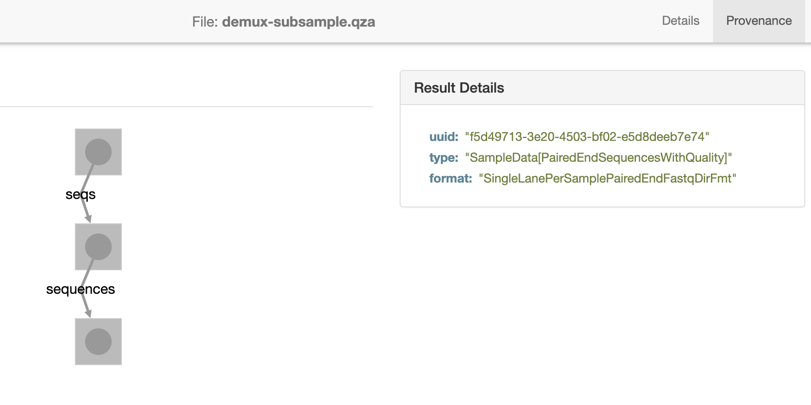
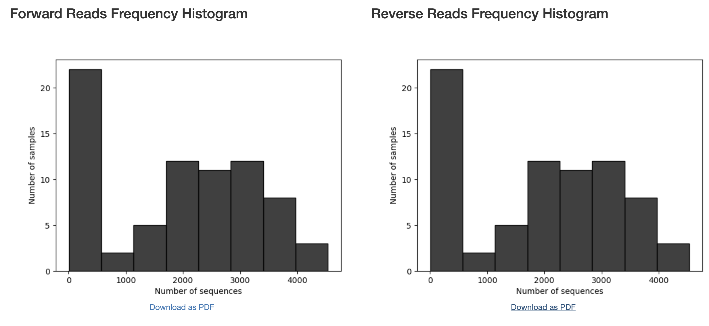
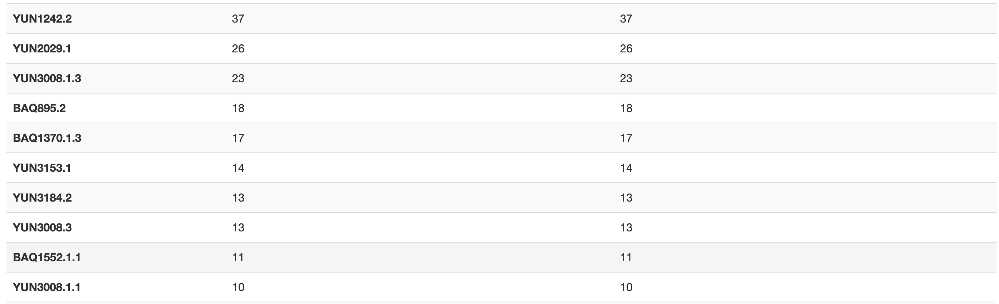
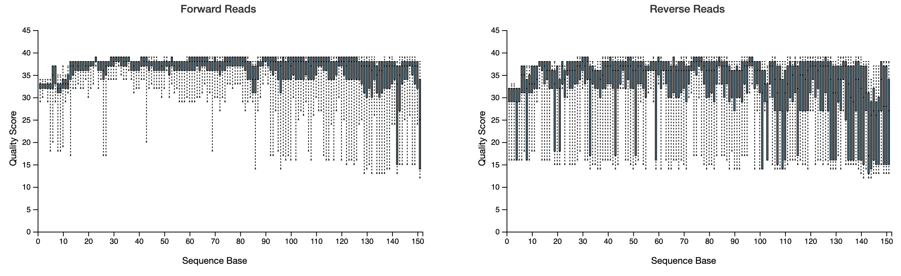
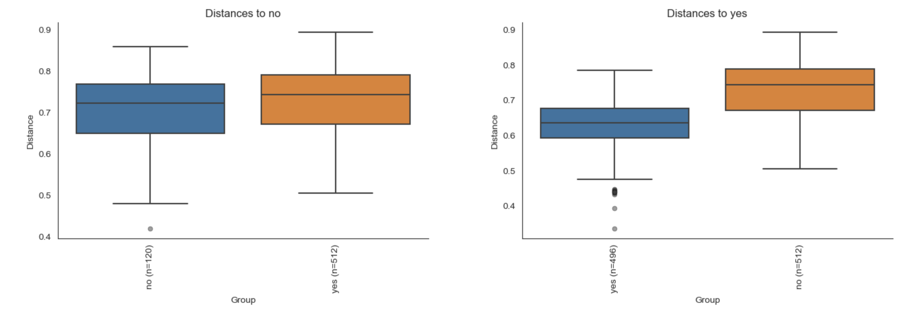
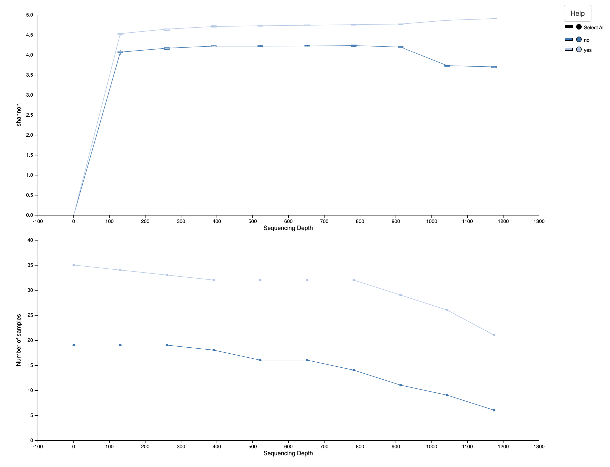
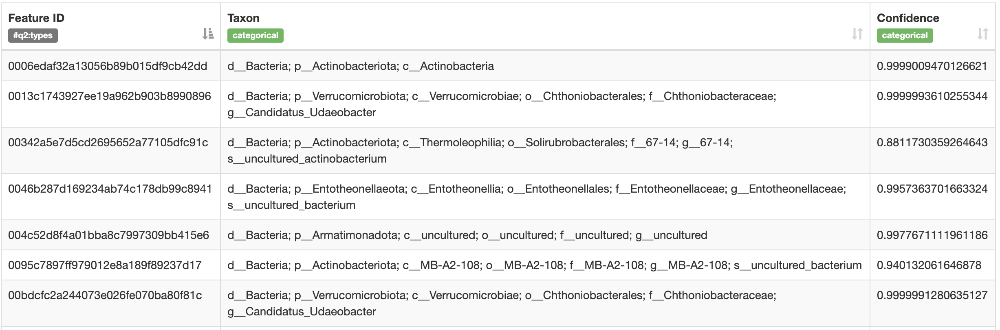
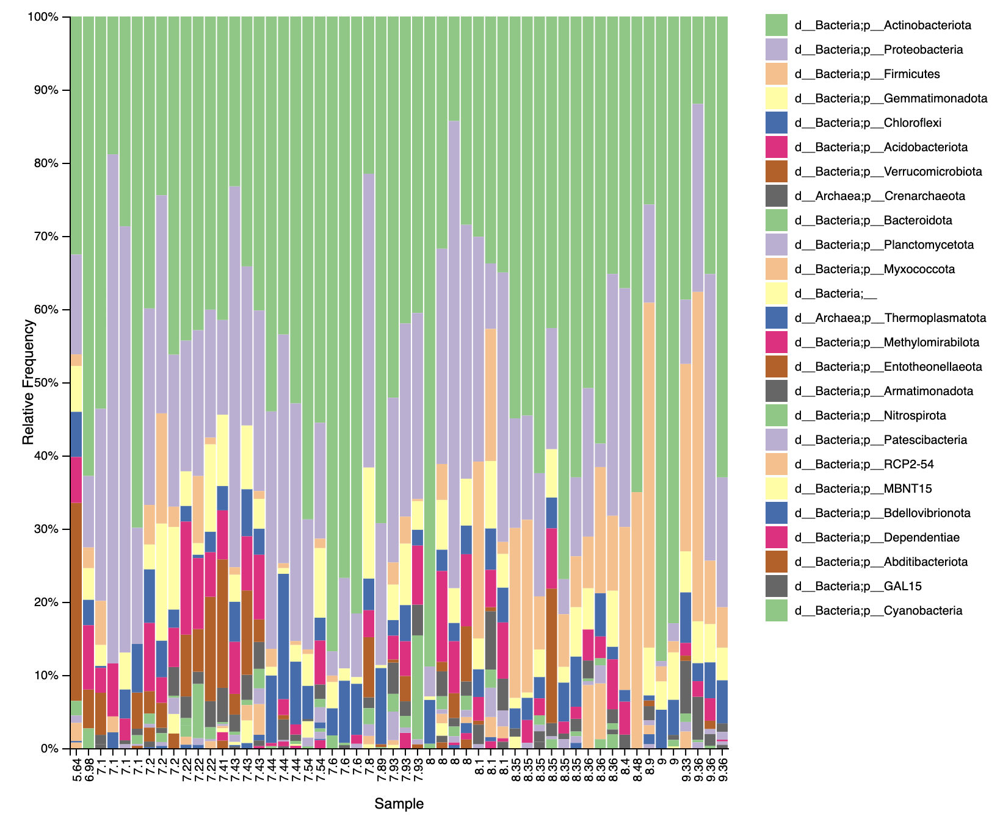

# Analysis of metabarcoding data with QIIME2 on WildIris


## Table of Contents


- [1. Introduction](#1-introduction)
- [2. Setup](#2-setup)
- [3. Read and process the data](#3-read-and-process-the-data)
	- [3.1 Demultiplexing](#3-1-demultiplexing)
	- [3.2 Denoising](#3-2-denoising)
- [4. Phylogenetic diversity analyses](#4-phylogenetic-diversity-analyses)
	- [4.1 Categorical tests](#4-1-categorical-tests)
	- [4.2 Continuous tests](#4-2-continuous-tests)
	- [4.3 Alpha rarefaction](#4-3-alpha-rarefaction)
- [5. Taxonomic analysis](#5-taxonomic-analysis)
- [6. Differential abundance testing with ANCOM](#6-differential-abundance-testing-with-ancom)
- [7. Scripting and organization](#7-scripting-and-organization)
- [8. Some other useful approaches](#8-some-other-useful-approaches)


<br><br><br>
<br><br><br>
<center>

</center>
<br><br><br>

## 1. Introduction

This tutorial is designed for users wanting to run Qiime2 on the INBRE WildIris high-performance computing (HPC) cluster that is hosted at the University of Wyoming (UW). This cluster is specifically implemented to support users outside of UW and does not require UW credentials/email for access. Hardware for this cluster was purchased with INBRE funds.

* I will assume some basic knowledge of WildIris, including how to log on, what a job is, etc. If you need a refresher, these concepts are covered in my [Intro to bash and the WildIris cluster](https://github.com/seanharrington256/WildIris_tutorial) tutorial.

This is a modification of a general tutorial I put together [here](https://github.com/seanharrington256/boise_qiime_2022) that is not specific to WildIris.

<br><br><br>
<br><br><br>


QIIME2 is a pipeline for metabarcoding analysis described in [this paper](https://www.nature.com/articles/s41587-019-0209-9). It is a piece of software that wraps around several other programs via "plugins" in QIIME2 lingo. For example, in the error correction or "denoising" step, one option is to use the `dada2` plugin to run [DADA2](https://benjjneb.github.io/dada2/). DADA2 is incorporated into the QIIME2 pipeline, but is not developed or maintained by the same group that develops and maintains QIIME2. Users can develop their own plugins and contribute them to the QIIME2 pipeline to extend functionality as new methods are developed.

The greatest advantage of QIIME2 is that it aggregates various tools into a single pipeline that uses a common grammar. This includes unifying data formatting so that users do not need to worry about complex file conversions to prep output from one program for input into another, which I personally find to be one of the most obnoxious hassles in bioinformatic analysis.

Another advantage of QIIME2 is that the files track the provenance of the data--i.e., QIIME2 tracks exactly how the data has been processed at every step up to any given analysis. We will explore this further as we start looking at QIIME2 files.


Today, we will use QIIME2 to explore soil microbiome data from the Atacama desert in Chile. The data are presented in [this paper](https://journals.asm.org/doi/full/10.1128/mSystems.00195-16).

This tutorial is adapted from the following tutorials in the QIIME2 documentation: [“Atacama soil microbiome” tutorial](https://docs.qiime2.org/2022.2/tutorials/atacama-soils/), [“Moving Pictures” tutorial](https://docs.qiime2.org/2022.2/tutorials/moving-pictures/), [Training feature classifiers](https://docs.qiime2.org/2022.2/tutorials/feature-classifier/). The QIIME2 documentation is extensive and features several tutorials. More detail on all of the concepts that we will cover today can be found in this documentation. 

Blocks of code to be entered into your command line terminal will look like this:

```bash
# This is a code block
```

The `#` denotes a comment in the bash language, and anything following that will not be interpreted by the system.


<br><br><br>


## 2. Setup

Log into WildIris, replacing `YOURUSERNAME` with your username:

```bash
ssh YOURUSERNAME@wildiris.arcc.uwyo.edu
```


QIIME2 is installed as a module on WildIris, so you will not need to install it yourself. If you find that you need a plugin that is not installed or a different version of QIIME2 (possibly to be able to install a plugin that is only available for a specific QIIME2 version), you can put in a software request to ARCC [here](https://arccwiki.atlassian.net/servicedesk/customer/portal/2/group/15/create/24).

You can see available versions of qiime2 by running:

```bash
module spider qiime2
```

This may change in the future, but I currently see two versions available. We can get more information on a single version by running 	`module spider` on any given version:

```bash
module spider qiime2/2023.5
```


This tells us that we can load the module directly, let's do that:

```bash
module load qiime2/2023.5
```


If we type `qiime`, we should get some basic info on the currently installed plugins and available commands (after some caching the first time).

Note that we will only want to run these commands to process data from within a SLURM script or an interactive `salloc` session, not on the login node that we are currently on. If you are not sure what I mean by this, review my WildIris intro tutorial linked in the Introduction section above. We'll see that as we start to work with data. First, we need to download data.


In whatever project you use on WildIris, I recommend making a directory called `qiime_tutorial`. 

`mkdir qiime_tutorial`

Your path to this directory will be different than mine, so keep track of where you've created this. Move into that directory, and then create two more directories, one for scripts, and one for raw data. This is how I typically organize my research projects, and then I put outputs into other directories.

```bash
cd qiime_tutorial
mkdir scripts
mkdir scripts/errs_outs # within scripts, make a directory to put err/out files into
mkdir raw_data
```

Move into the `raw_data` directory and then download the data we'll use:


```bash
wget \
  -O "sample-metadata.tsv" \
  "https://data.qiime2.org/2022.2/tutorials/atacama-soils/sample_metadata.tsv"
  
mkdir emp-paired-end-sequences
wget \
  -O "emp-paired-end-sequences/forward.fastq.gz" \
  "https://data.qiime2.org/2022.2/tutorials/atacama-soils/10p/forward.fastq.gz"
wget \
  -O "emp-paired-end-sequences/reverse.fastq.gz" \
  "https://data.qiime2.org/2022.2/tutorials/atacama-soils/10p/reverse.fastq.gz"
wget \
  -O "emp-paired-end-sequences/barcodes.fastq.gz" \
  "https://data.qiime2.org/2022.2/tutorials/atacama-soils/10p/barcodes.fastq.gz"
  
```

Note that the slashes are just escaping line endings so that `wget` commands are interpreted as a single-line commands while allowing them to easily fit on this page.

We should now have the sample metadata, raw reads, and barcodes for the samples.

Take a look at the sample metadata in the `sample_metadata.tsv` file to get familiar with what we're working with here. We have a mixture of categorical variables, such as site-name, and continuous variables, such as elevation.


<br><br><br>


## 3. Read and process the data

Now we can import the data and prepare it for analysis in QIIME2. As touched on above, QIIME2 puts things into its own file format, and so the first step is to read the raw data into QIIME2 format.

* As mentioned above, you will need to run QIIME2 from within an interactive session or by submitting jobs with a SLURM script. I'll demonstrate both here for the data import step, but then will mostly run through these steps in an interactive session, with exceptions for longer steps. 

```
salloc -A YOURPROJECT -t 0-03:00 --mem=10G --cpus-per-task=2
```

* Note that running `salloc` sessions and typing commands directly into the console can be convenient for small datasets, but you should be keeping a record of the commands you type somewhere. A huge advantage of using slurm scripts, even for short jobs is that you have a file that records the exact commmands you ran. In my own analyses, I use slurm scripts for all but the shortest, simplest tasks.

* The `-A` option in the `salloc` command or in slurm scripts specifies which project to use, you will need your own project for this.


Once you are on a worker node, you can then run the command to import data into QIIME2 format:


```bash
module load qiime2/2023.5   # we need to load the module on the worker node now

qiime tools import \
   --type EMPPairedEndSequences \
   --input-path emp-paired-end-sequences \
   --output-path ../emp-paired-end-sequences.qza
```

This creates a QIIME2 file called an artifact. QIIME2 uses two file formats, "QIIME zipped artifacts" or ".qza" files and "QIIME zipped visualizations" or ".qzv" files. Both are just zip files with different names. qza files contain data and provenance (information about what has been done to the data) while qzv files, which we'll see shortly, contain visualizations, as the name suggests.

Because of the way that I have specified the output path, this file will be created in the `qiime_tutorial` directory, one level above where we are now. This keeps up from confusing our outputs with our raw data.


<br>

Alternately, submitting this as a batch job can be done by writing a slurm script, which I've titled `import.slurm`:

I would first move into my scripts directory and create this script there. 

```bash
cd ../scripts
```

Then create this script there, however you prefer (`vim`, `nano`, using a text editor with CyberDuck).

```bash
#!/bin/bash

#SBATCH --job-name import   # give the job a name
#SBATCH -A YOURPROJECT    # specify the account
#SBATCH -t 0-01:00		 # how much time? this is 1 hour
#SBATCH --nodes=1			# how many nodes?
#SBATCH --cpus-per-task=1	# 1 cores
#SBATCH --mem=10G			# 10 GB memory
#SBATCH --mail-type=ALL		# Send emails on start, fail, completion
#SBATCH --mail-user=USERNAME@gmail.com   # specify your email
#SBATCH -e errs_outs/err_import_%A.err		# name error files and include job ID (%A)
#SBATCH -o errs_outs/std_import_%A.out		# name  out files and include job ID (%A)

# Load any necessary modules 
module load qiime2/2023.5

# set the working directory as appropriate
cd YOUR_PATH_TO/qiime_tutorial/raw_data # Edit this to your path

# Run the desired commands
qiime tools import \
   --type EMPPairedEndSequences \
   --input-path emp-paired-end-sequences \
   --output-path ../emp-paired-end-sequences.qza
```

* You could include multiple steps into a single script if desired.

Submit the job:

```bash
sbatch import.slurm
```


<br><br>

### 3.1 Demultiplexing

We now need to demultiplex the sequences, which sorts the reads into samples based on barcodes added in the library preparation. As stated above, I'm going to do most of this on the command line from within my interactive session here, but you could make all of these steps run from slurm scripts, and with larger datasets, that is probably desirable.

```bash
qiime demux emp-paired \
  --m-barcodes-file raw_data/sample-metadata.tsv \
  --m-barcodes-column barcode-sequence \
  --p-rev-comp-mapping-barcodes \
  --i-seqs emp-paired-end-sequences.qza \
  --o-per-sample-sequences demux-full.qza \
  --o-error-correction-details demux-details.qza
```


Note that most options to QIIME2 commands share a general structure. They all start `qiime`, followed by the plugin being used (`demux` here), then the specific method being applied (here `emp-paired` to demultiplex paired-end data generated with the EMP protocol), followed by arguments. Arguments starting `--i` designate input, arguments starting `--o` designate output, arguments starting `--m` designate metadata, and arguments starting `--p` (we'll see these in a second) designate parameters being fed to the method being used. You can get help for plugins or methods by typing `--help`, e.g., `qiime demux --help` or `qiime demux emp-paired --help`.


To make things run faster, we'll subsample only 30% of the reads. **This is not a general step for most pipelines**. You will typically want to use all of your data unless you have a specific reason for subsampling.

```bash
qiime demux subsample-paired \
  --i-sequences demux-full.qza \
  --p-fraction 0.3 \
  --o-subsampled-sequences demux-subsample.qza

qiime demux summarize \
  --i-data demux-subsample.qza \
  --o-visualization demux-subsample.qzv
```


Before we go any further, let's do a quick exploration of a .qza file. We can use [https://view.qiime2.org/](https://view.qiime2.org/) to examine these. 

* You will need to download these files locally first. You can use CyberDuck, `scp`, `rsync` or whatever you prefer. These are documented in the WildIris intro I have linked above if you are not familiar with these commands/programs.
 
Bring the `demux-subsample.qza` file into that website. It will start in the details tab, where you can see information about the format as well as citations. You can see that even just for demultiplexing, there are already three citations. These should all go into your methods section, along with a detailed description of the specific commands, plugins, and arguments that you used to run your analyses and process your data: "we demultiplexed the data using QIIME2" is not adequate for anyone to reproduce your results. The QIIME2 documentation has excellent examples of good and bad description of QIIME2 methods sections [here](https://docs.qiime2.org/2022.2/citation/).

You can also click on the "provenance" tab to see what manipulations have been done to your data. You should see something like this:

<center>

</center>


This tells us important information, but isn't very interesting from a scientific perspective of trying to learn about the data and make inferences. Visualiztion (qzv) files are much more intersting for these purposes. We can download the `demux-subsample.qzv` and bring it into that website.

The `Overview` tab shows some general stats on how many reads we have per sample. From looking at the histograms, we see that a lot of samples have very few reads. If we scroll down to look at the table, we see that we have a lot of samples that have fewer than 100 reads in them. 

<center>

</center>

<center>

</center>


This isn't enough reads for meaningful analysis, so we'll filter these out in the next step. You do not necessarily need to run through this step in other analyses. Think carefully about what thresholds you may want to use when filtering out any data.

```bash
qiime tools export \
  --input-path demux-subsample.qzv \
  --output-path ./demux-subsample/

qiime demux filter-samples \
  --i-demux demux-subsample.qza \
  --m-metadata-file ./demux-subsample/per-sample-fastq-counts.tsv \
  --p-where 'CAST([forward sequence count] AS INT) > 100' \
  --o-filtered-demux demux.qza
```


<br><br>

### 3.2 Denoising

Our next step is to "denoise", or error correct, the data. This is an important step in the analysis of metabarcoding data because the units of analysis are unique sequences, presumed to be from unique organisms. However, all sequencers encounter sequencing errors, which produce sequences that are slightly different from the true sequence. We will use DADA2 (via the dada2 plugin) to error correct our data--this is a complex process, and you can read more about it [here](https://www.nature.com/articles/nmeth.3869)--this is not the only option for error correction in QIIME2. This step will also include some trimming of our reads and will merge the forward and reverse reads. 

To determine some of our trimming paramters, let's look back at our visualization `demux-subsample.qzv` and look in the `Interactive Quality Plot` tab at [https://view.qiime2.org/](https://view.qiime2.org/).


You should see something like this:

<center>

</center>

You can hover your mouse over the plot to get information about specific positions along the reads.

We have 150 bp paired-end reads, and quality is reasonably high throughout, but we can see that the first ~13 bp of both forward and reverse reads is a little low, so we'll trim those out. We'll also truncate reads in both directions to 150 bp, since none should be longer than this. Note that we have set these the same for forward and reverse reads, but that is not necessary.


As a reminder that we can do any and all of these steps in a slurm script, I'll use one for this step. Also remember that this can be good practice because it inherently keeps a record of your commands. We will also include a few other commands to make summaries of the output and demonstrate including multiple commands into a single script.


In your `scripts` directory, create a script called `denoise.slurm` containing the following (replace the account, email, and file paths with your own):

```bash
#!/bin/bash

#SBATCH --job-name denoise   # give the job a name
#SBATCH -A YOURPROJECT    # specify the account
#SBATCH -t 0-01:00		 # how much time? this is 1 hour
#SBATCH --nodes=1			# how many nodes?
#SBATCH --cpus-per-task=1	# 1 cores
#SBATCH --mem=10G			# 10 GB memory
#SBATCH --mail-type=ALL		# Send emails on start, fail, completion
#SBATCH --mail-user=USERNAME@gmail.com   # specify your email
#SBATCH -e errs_outs/err_denoise_%A.err		# name error files and include job ID (%A)
#SBATCH -o errs_outs/std_denoise_%A.out		# name  out files and include job ID (%A)

# Load any necessary modules 
module load qiime2/2023.5

# set the working directory as appropriate
cd YOUR_PATH_TO/qiime_tutorial/ # Edit this to your path

# Run the denoising command:

qiime dada2 denoise-paired \
  --i-demultiplexed-seqs demux.qza \
  --p-trim-left-f 13 \
  --p-trim-left-r 13 \
  --p-trunc-len-f 150 \
  --p-trunc-len-r 150 \
  --o-table table.qza \
  --o-representative-sequences rep-seqs.qza \
  --o-denoising-stats denoising-stats.qza
  

# make some summaries:
qiime feature-table summarize \
  --i-table table.qza \
  --o-visualization table.qzv \
  --m-sample-metadata-file raw_data/sample-metadata.tsv

qiime feature-table tabulate-seqs \
  --i-data rep-seqs.qza \
  --o-visualization rep-seqs.qzv

qiime metadata tabulate \
  --m-input-file denoising-stats.qza \
  --o-visualization denoising-stats.qzv  
```


Submit the job:

```bash
sbatch denoise.slurm
```


Then download each of these three visualizations (`table.qzv`, `rep-seqs.qzv`, `denoising-stats.qzv`) and take them to [https://view.qiime2.org/](https://view.qiime2.org/) to explore them.


<br><br><br>

## 4. Phylogenetic diversity analyses


Now that we have the data fully read in and processed, we can start to do some analysis that will tell us about the biology of our system. We're going to start with diversity analyses. This includes how many taxa we have in our samples, how distinct the taxonomic composition of different samples or metadata categories are, and related metrics.

Many of these metrics include phylogenetic distance in their calculation, and to do that, we need a tree. We'll start by making one. We'll use the `phylogeny` plugin to use the [MAFFT](https://mafft.cbrc.jp/alignment/software/) program for sequence alignment, followed by phylogenetic analysis in the program [FastTree](http://www.microbesonline.org/fasttree/). As for many of the methods in QIIME2, these are external programs that are being called by the QIIME2 pipeline. There are multiple other options that you can explore using `--help`.

I'm going to shift back to just running this interactively in my `salloc` session that has the qiime2 module loaded:

```bash
qiime phylogeny align-to-tree-mafft-fasttree \
  --i-sequences rep-seqs.qza \
  --o-alignment aligned-rep-seqs.qza \
  --o-masked-alignment masked-aligned-rep-seqs.qza \
  --o-tree unrooted-tree.qza \
  --o-rooted-tree rooted-tree.qza
```


Next, we can start to calculate some diversity metrics. We have to specify a minimum sampling depth (`--p-sampling-depth`) for these calculations. This threshold is important: any samples with more than the specified depth will be randomly sampled to contain only that many features, whereas samples with fewer features will be discarded from analysis. 

This is necessary because using different numbers of features across samples can bias estimates of diversity. There is no easy rule for selecting this threshold, other than that we want to try to select a threshold that maximizes the number of features without dropping out too many samples. 

Let's look at the *Interactive Sample Detail* section of `table.qzv` to help us figure out what threshold to use. Download that visualization file and bring it into the qiime2view website.


In this document, click on the *Interactive Sample Detail*  tab up top. As you move the *Sampling Depth* slider around you can see a visual representation of how many samples will be retained. You can also scroll down the table to see if there is a point at which there is a sharp decline in the Feature Counts, the value just prior to such a drop off can be good to use.

What do you think is a reasonable value to use? 

When selecting this threshold, keep in mind that we also want to keep an eye on how dropping out samples affects how many samples we retain in different metadata categories. E.g., if we had 5 samples from each of two locations that we want to compare, a sampling threshold that excludes all samples from one of those sites would make comparisons impossible.

Once we've selected a good sampling depth, we can calculate our diversity metrics:


```bash
qiime diversity core-metrics-phylogenetic \
  --i-phylogeny rooted-tree.qza \
  --i-table table.qza \
  --p-sampling-depth 689 \
  --m-metadata-file raw_data/sample-metadata.tsv \
  --output-dir core-metrics-results
```

**Note that the 689 I used here may not be exactly what you want to use.** When we subsampled reads at the beginning to reduce computation time, we did so randomly, so everyone will have slightly different datasets containing different reads. This will affect any specific values used throughout this tutorial.

This generates a lot of output that is worth looking through, take a look at all of the artifacts and visualizations that were created: `ls core-metrics-results`.

For each of the beta diversity metrics, a principal coordinates analysis (PCoA) plot was generated using Emperor. Let's take a look at this file on the qiime2view website: `core-metrics-results/bray_curtis_emperor.qzv`


You can color the points by values of different variables. For continuous variables, try selecting a color scheme from the sequential or diverging sets of colors, these should make it easier to identify trends.

Are there any particular variables that seem to be strongly associated with beta diversity?

<br><br>

### 4.1 Categorical tests

Now that we have computed the diversity metrics and done some qualitative exploration of the emperor plots, we can explicitly test for associations between these diversity metrics and the sample metadata. We can test for differences among categorical groups (e.g., using the `vegetation` column, which is yes/no) or correlations with continuous variables, such as `percentcover`.

Let's start with categorical tests using the evenness and Faith Phylogenetic Diversity metrics. 


```bash
qiime diversity alpha-group-significance \
  --i-alpha-diversity core-metrics-results/evenness_vector.qza \
  --m-metadata-file raw_data/sample-metadata.tsv \
  --o-visualization core-metrics-results/evenness-group-significance.qzv
  

qiime diversity alpha-group-significance \
  --i-alpha-diversity core-metrics-results/faith_pd_vector.qza \
  --m-metadata-file raw_data/sample-metadata.tsv \
  --o-visualization core-metrics-results/faith-pd-group-significance.qzv  
```

Take a look at these resulting files:

```
core-metrics-results/evenness-group-significance.qzv

core-metrics-results/faith-pd-group-significance.qzv
```

Just below `Alpha Diversity Boxplots` you should see a dropdown box labeled "Column", use this to select a variable to view results from.


What associations are statistically significant?


Now let's look at how beta diversity composition varies across categorical variables using PERMANOVA. This tests if distances between samples within a group are more similar to each other than to samples from other groups. Because it uses permutation to assess significance, this command can be slow, and so we will only run it on the vegetation column of our metadata right now. The addition of the `--p-pairwise` option will perform pairwise tests to determine which groups are significantly different from each other--note that this is redundant here because we only have two groups for vegetation.

```bash
qiime diversity beta-group-significance \
  --i-distance-matrix core-metrics-results/unweighted_unifrac_distance_matrix.qza \
  --m-metadata-file raw_data/sample-metadata.tsv \
  --m-metadata-column vegetation \
  --o-visualization core-metrics-results/unweighted-unifrac-vegetation-significance.qzv \
  --p-pairwise
```

Take a look at `core-metrics-results/unweighted-unifrac-vegetation-significance.qzv`


<center>

</center>


Are there any other categorical comparisons that are worth making?

<br><br>

### 4.2 Continuous tests

We can also make correlations between diversity and continuous variables from the metadata. As above, we'll start with alpha diversity:

```bash
qiime diversity alpha-correlation \
	--i-alpha-diversity core-metrics-results/faith_pd_vector.qza \
	--m-metadata-file raw_data/sample-metadata.tsv \
	--p-method spearman \
	--o-visualization core-metrics-results/faith-pd-correlation.qzv
```


View the file `core-metrics-results/faith-pd-correlation.qzv`


What relationships are significant? Note that we can also run this correlation using evenness or with a Pearson correlation test instead of Spearman.


Let's now look for significant correlations using beta diversity.

To do this, we need to first calculate a distance matrix from the column of interest from the metadata. Here we'll use just elevation, but you are free to explore other variables as well. 


```bash
qiime metadata distance-matrix \
	--m-metadata-file raw_data/sample-metadata.tsv \
	--m-metadata-column elevation \
	--o-distance-matrix core-metrics-results/elevation-dist-mat.qza
```


Then we can use a Mantel test to test for an association between this distance matrix and one of our metrics of beta diversity. We'll use just unweighted unifrac distance, but we can do this with any metric.


```bash
qiime diversity mantel \
	--i-dm1 core-metrics-results/elevation-dist-mat.qza \
	--i-dm2 core-metrics-results/unweighted_unifrac_distance_matrix.qza \
	--p-method spearman \
	--p-label1 elevation \
	--p-label2 unweighted_unifrac \
	--p-intersect-ids \
	--o-visualization core-metrics-results/unweight_unifrac_elevation_mantel.qzv
```

View the resulting visualization `core-metrics-results/unweight_unifrac_elevation_mantel.qzv`


You'll see a warning that there were some number of IDs weren't shared between your distance matrices. This is because early on we filtered out some samples, then further filtered samples for sampling depth during the calculation of diversity metrics, whereas the metadata contains all samples. This mismatch is why we need to include the `--p-intersect-ids` flag here to tell the analysis to only include samples in both distance matrices that we input.


We could alternately use the `qiime diversity bioenv` method in a similar way to test for relationships between continuous variables and beta diversity metrics, but we won't explore it here. You can run `qiime diversity mantel --help` for more info on this. 

<br><br>

### 4.3 Alpha rarefaction

Alpha rarefaction plotting will compute alpha diversity at multiple sampling depths and then visualize how increased sampling affects estimates of alpha diversity. 


```bash
qiime diversity alpha-rarefaction \
  --i-table table.qza \
  --i-phylogeny rooted-tree.qza \
  --p-max-depth 1175 \
  --m-metadata-file raw_data/sample-metadata.tsv \
  --o-visualization alpha-rarefaction.qzv
```


The parameter `--p-max-depth` should be chosen from the information in `table.qzv` that we generated previously. Using roughly the median frequency is generally recommended, but you may want to increase the value if your rarefaction plot does not level out or decrease it if you are losing many of your samples at this depth. We've chosen the median above, let's see how it looks, again downloading this file and putting it in the qiime2view site: `alpha-rarefaction.qzv`


The top plot shows us how much diversity we detect at varying sequencing depths. We should specifically check that the value that we used for `--p-sampling-depth` when calculating diversity metrics looks good.

If the plot has leveled off, we can be reasonably confident that we are accurately characterizing the diversity in our samples. If the plots do not level off, that suggests that further sequencing may be needed to detect additional features in the samples and accurately characterize diversity.

How does this plot look to you? Do you think that the sequencing depth is adequate?

The bottom plot shows the number of samples that remain in each category when grouping by metadata columns (select which to look at in the dropdown box above the top plot). This is important to look at because if the diversity metric in the top plot is calculated from very few samples at a given sampling depth, that estimate of diversity may be unreliable. In fact, if you look at Shannon diversity for vegetation, you can see that at the highest sequencing depth, the number of samples drops low.

<center>

</center>


<br><br><br>

## 5. Taxonomic analysis


Next up, we'll start to explore the taxonomic composition of our samples. We will start by training a taxonomic classifier. I won't dive into how this works, but you can read all about it [here](https://microbiomejournal.biomedcentral.com/articles/10.1186/s40168-018-0470-z). There are several existing, pre-trained classifiers that exist for QIIME2, but the developers recommend training your own classifier, as they perform best when tailored to your specific data.

We'll mostly follow the documentation [here](https://docs.qiime2.org/2022.2/tutorials/feature-classifier/) to train our classifier. However, instead of using the reference dataset they use, we'll use the Silva dataset. Both Silva and GreenGenes datasets are downloaded on WildIris as documented [here](https://arccwiki.atlassian.net/wiki/spaces/DOCUMENTAT/pages/107151729/Qiime2#Data-Resources). As described there, the environment variable `QIIME_DATA_RESOURCES` points to the location of the taxonomic datasets.

We will use sequence and taxonomy files that have already been imported into Qiime2 format as `.qza` files, however, we still need to extract the reads from the reference sequences to match our data. Here we use the same primers that were used to generate the data and set some min & max length parameters to exclude amplicons that are too short or long. We won't truncate the reads to a specific length because we have paired end data, and the merged reads end up as variable lengths.


This will take a while (and is a good candidate for a slurm script!):

```bash
qiime feature-classifier extract-reads \
  --i-sequences $QIIME_DATA_RESOURCES/silva-138-99-seqs.qza \
  --p-f-primer GTGCCAGCMGCCGCGGTAA \
  --p-r-primer GGACTACHVGGGTWTCTAAT \
  --p-min-length 100 \
  --p-max-length 400 \
  --o-reads ref-seqs.qza
```


* This will vary if you want to use a different taxonomic dataset or if you use different PCR primers.


Then we can run the Naive Bayes classifier. This I will run in a script because it uses more memory than my `salloc` session has allocated and takes quite a while (about an hour for me).

Create a script called `train_class.slurm` in the `scripts` directory:

```bash
#!/bin/bash

#SBATCH --job-name train_class   # give the job a name
#SBATCH -A YOURPROJECT    # specify the account
#SBATCH -t 0-01:00		 # how much time? this is 1 hour
#SBATCH --nodes=1			# how many nodes?
#SBATCH --cpus-per-task=1	# 1 cores
#SBATCH --mem=24G			# 10 GB memory
#SBATCH --mail-type=ALL		# Send emails on start, fail, completion
#SBATCH --mail-user=USERNAME@gmail.com   # specify your email
#SBATCH -e errs_outs/err_train_%A.err		# name error files and include job ID (%A)
#SBATCH -o errs_outs/std_train_%A.out		# name  out files and include job ID (%A)

# Load any necessary modules 
module load qiime2/2023.5

# set the working directory as appropriate
cd YOUR_PATH_TO/qiime_tutorial/ # Edit this to your path

# Train the classifier:

qiime feature-classifier fit-classifier-naive-bayes \
  --i-reference-reads ref-seqs.qza \
  --i-reference-taxonomy $QIIME_DATA_RESOURCES/silva-138-99-tax.qza \
  --o-classifier classifier.qza
```

* Note that the `reference-taxonomy` argument has to match the sequences used

Run the script:

```bash
sbatch train_class.slurm
```


This will train the classifier on the reference data. When that completes, we can run the classifier on our data to determine what taxa are present in our samples. Then we can make a visualization of this


```bash
qiime feature-classifier classify-sklearn \
  --i-classifier classifier.qza \
  --i-reads rep-seqs.qza \
  --o-classification taxonomy.qza

qiime metadata tabulate \
  --m-input-file taxonomy.qza \
  --o-visualization taxonomy.qzv
```


Take a look at that file: `taxonomy.qzv`

<center>

</center>


This tells us what taxon each feature is identified as, but doesn't tell us much at a glance, so let's make some bar plots:

```bash
qiime taxa barplot \
  --i-table table.qza \
  --i-taxonomy taxonomy.qza \
  --m-metadata-file raw_data/sample-metadata.tsv \
  --o-visualization taxa-bar-plots.qzv
```

Then view the resulting `taxa-bar-plots.qzv`

We can now explore the taxonomic composition of the samples at various taxonomic levels and grouping by the different metadata categories.


Set the `Taxonomic level` to *Level 2* (corresponding to phyla) and then `Sort Samples By` *ph*. Do you see any trends in phyla that seem to be associated with high vs. low ph?


<center>

</center>


<br><br><br>

## 6. Differential abundance testing with ANCOM

The final analysis that we'll run is to perform explicit tests for features that are differentially abundant across sample groups using [ANCOM](https://pubmed.ncbi.nlm.nih.gov/26028277/). ANCOM is a method specifically designed top test for the differential abundance of taxa in microbiome data.


To do this, we need to use `add-pseudocount` to generate a `FeatureTable[Composition]` QIIME artifact. In our current feature table, many sequences/taxa will have frequencies of zero in multiple samples. However, ANCOM cannot handle frequencies of zero, and so `add-pseudocount` is used to impute values and make the data suitable for ANCOM analysis.


```bash
qiime composition add-pseudocount \
  --i-table table.qza \
  --o-composition-table comp-table.qza
```

Then we'll run ANCOM on the `vegetation` column to see if we have any significant differential abundance across vegetation categories.

```bash
qiime composition ancom \
  --i-table comp-table.qza \
  --m-metadata-file raw_data/sample-metadata.tsv \
  --m-metadata-column vegetation \
  --o-visualization ancom-vegetation.qzv
```

Visualize this file: `ancom-vegetation.qzv`


This shows us individual features that are differentially abundant across vegetation categories. We may instead or additionally be interested in how certain taxa at a given taxonomic level differ across groups.

Let's collapse our features into sets of taxa, starting with the genus level

```bash
qiime taxa collapse \
  --i-table table.qza \
  --i-taxonomy taxonomy.qza \
  --p-level 6 \
  --o-collapsed-table table-l6.qza

qiime composition add-pseudocount \
  --i-table table-l6.qza \
  --o-composition-table comp-table-l6.qza

qiime composition ancom \
  --i-table comp-table-l6.qza \
  --m-metadata-file raw_data/sample-metadata.tsv \
  --m-metadata-column vegetation \
  --o-visualization l6-ancom-vegetation.qzv
```

Take a look at the visualization `l6-ancom-vegetation.qzv`


We can also do the same for phyla:

```bash
qiime taxa collapse \
  --i-table table.qza \
  --i-taxonomy taxonomy.qza \
  --p-level 2 \
  --o-collapsed-table table-l2.qza

qiime composition add-pseudocount \
  --i-table table-l2.qza \
  --o-composition-table comp-table-l2.qza

qiime composition ancom \
  --i-table comp-table-l2.qza \
  --m-metadata-file raw_data/sample-metadata.tsv \
  --m-metadata-column vegetation \
  --o-visualization l2-ancom-vegetation.qzv
```

And then view the `l2-ancom-vegetation.qzv` file


What phyla differ among the vegetated and non-vegetated sites?


QIIME2 also includes another method for differential abundance analysis, called Gneiss. We won't explore it today, but it is documented [here](https://docs.qiime2.org/2022.2/tutorials/gneiss/).


<br><br><br>


## 7. Scripting and organization

As stated above, I ran through most of this tutorial showing commands as they would be entered into the command line in an interactive session. This is mostly to be able to show individual commands and document them without lumping too many together or cluttering everything up with loads of slurm script headers. We also just dumped most of our outputs directly into the main `qiime_tutorial` directory, which is not very organized.

When working with my own data, I would instead script everything, 


## 8. Some other useful approaches

QIIME2 is only one pipeline for microbiome analysis. You could alternately do all of these steps using command line tools or even in R without using QIIME2 at all. R can make some really fancy figures, so even if you do most of your data processing and analysis in QIIME2, you may want to export your data from QIIME2 ([see here for documentation](https://docs.qiime2.org/2022.2/tutorials/exporting/)) to run some analyses and make nice graphics for publication.


Here are a few tutorials for microbiome analysis in R:

- [Workflow for Microbiome Data Analysis: from raw reads to community analyses]( https://bioconductor.org/help/course-materials/2017/BioC2017/Day1/Workshops/Microbiome/MicrobiomeWorkflowII.html)

- [Introduction to the Statistical Analysis of Microbiome Data in R](https://www.nicholas-ollberding.com/post/introduction-to-the-statistical-analysis-of-microbiome-data-in-r/)

- [How to give life to your microbiome data](https://towardsdatascience.com/how-to-give-life-to-your-microbiome-data-using-plotly-r-1892281183cf)

- [Microbiome analysis in R November 2021](https://uw-madison-microbiome-hub.github.io/Microbiome_analysis_in-_R/)


Full disclosure: I haven't run through these and can't vouch for them or that all code is current and runs, but they look nice.


<br><br><br>